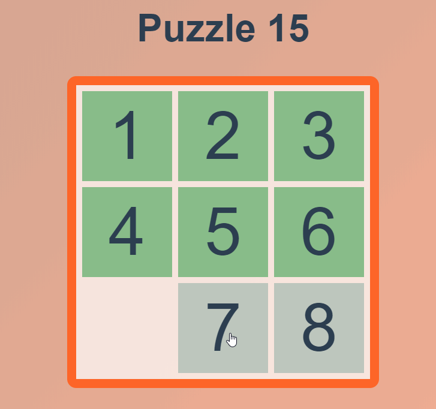

# Puzzle 15

# Challenge for a company (Puzzle 15)

> Live version at: [https://kevingermain.github.io/puzzle15](https://kevingermain.github.io/puzzle15)

----

[A puzzle 15](https://en.wikipedia.org/wiki/15_puzzle) is a sliding puzzle that consists of a frame of numbered square tiles in random order with one tile missing.

----

## Setup

`git clone https://kevingermain.github.io/puzzle15 && cd puzzle15`

`npm i && npm run serve`

## Build

`npm run build`

----

## Improvements

- [ ] Custom size of the grid
- [ ] Add tests
- [ ] Use keyboard arrows
